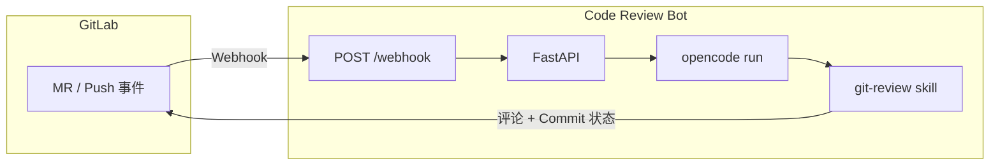

# Code Review Bot

基于 [OpenCode](https://opencode.ai/) **Skill** 的 AI 代码审查服务：在 GitLab 里配置一条 Webhook（MR 或 Push），即可在每次变更时自动运行 **git-review** skill，并将审查结果同步回 MR 或 Commit。

---

## 架构与流程

GitLab 在 MR 或 Push 时向本服务发送 Webhook，服务接收后调用 OpenCode 执行 **git-review** skill（拉仓库、算 diff、做 AI 审查），再将审查结果通过 GitLab API 写回（MR 评论或 Commit 评论 + Commit 状态）。整体是「事件驱动、异步回写」，同一仓库串行审查，不同仓库可并发。



---

## 部署

支持两种方式：

- **本地运行**：需在本机安装 OpenCode CLI 并完成认证，详见 [开发环境](#开发环境)。
- **Docker**：镜像内已包含 OpenCode，通过环境变量 `OPENCODE_CONFIG_CONTENT` 传入配置（由 entrypoint 写入 opencode.json），详见 [Docker Compose 部署](#docker-compose-部署) 或 [docker run 部署](#docker-run-部署)。

### 环境变量

无论本地或 Docker，都需先配置环境变量：复制 `.env.example` 为 `.env` 后按需修改。

| 变量 | 必需 | 默认 | 说明 |
|------|:----:|------|------|
| `GITLAB_TOKEN` | ✓ | - | GitLab Personal Access Token，需具备 `api` scope |
| `OPENCODE_CONFIG_CONTENT` | ✓(Docker) | - | 完整 opencode.json 内容（单行 JSON） |
| `GITLAB_URL` | | `http://localhost` | GitLab 实例地址 |
| `REPO_WORKSPACE` | | `repos` | 仓库克隆缓存目录（Docker 内为 `/app/repos`） |
| `OPENCODE_CMD` | | `opencode` | OpenCode 可执行命令名 |
| `OPENCODE_LOG_LEVEL` | | `WARN` | OpenCode 日志级别 |
| `OPENCODE_MODEL` | | - | 模型标识，格式 `provider/model` |
| `HOST` | | `0.0.0.0` | 服务监听地址 |
| `PORT` | | `5000` | 服务监听端口 |
| `REVIEW_TIMEOUT` | | `600` | 单次审查超时（秒） |
| `API_TIMEOUT` | | `10` | 调用 GitLab API 超时（秒） |
| `LOG_FILE` | | 空 | 应用日志文件路径（Docker Compose 默认 `/app/logs/app.log`） |

**OPENCODE_CONFIG_CONTENT 示例**

Docker 部署时，entrypoint 会将上述内容写入 `/root/.config/opencode/opencode.json`。支持任意 OpenCode provider；`apiKey` 可直接写在 JSON 中，或使用 `{env:变量名}` 从环境变量读取。

```bash
# agione
OPENCODE_CONFIG_CONTENT='{"$schema":"https://opencode.ai/config.json","provider":{"agione":{"npm":"@ai-sdk/openai-compatible","name":"agione","options":{"baseURL":"https://zh.agione.co/hyperone/xapi/api","apiKey":"ak-你的Key"},"models":{"131249505071992832":{"name":"GLM-4"}}}}}'
OPENCODE_MODEL=agione/131249505071992832
```

```bash
# OpenAI
OPENCODE_CONFIG_CONTENT='{"$schema":"https://opencode.ai/config.json","model":"openai/gpt-4o","provider":{"openai":{"options":{"apiKey":"sk-xxx"}}}}'
```

> 注意：JSON 里模型 ID 的 key 必须为字符串，例如 `"131249505071992832"`。

### Docker Compose 部署

环境变量配置见上一节表格，至少设置 `GITLAB_TOKEN`、`GITLAB_URL`、`OPENCODE_CONFIG_CONTENT`。

```bash
cd code-review-bot
cp .env.example .env
# 编辑 .env 后启动
docker compose up -d
docker compose logs -f
```

默认会挂载当前目录下的 `./repos`（仓库缓存）与 `./logs`（应用日志）。

### docker run 部署

不依赖 Compose 时，可单独构建镜像并用 `docker run` 启动：

```bash
# 在项目根目录构建镜像
docker build -t code-review-bot:latest .

# 启动容器（请将 GITLAB_URL、GITLAB_TOKEN、OPENCODE_CONFIG_CONTENT 等替换为实际值）
docker run -d \
  --name code-review-bot \
  --restart unless-stopped \
  -p 5000:5000 \
  -e GITLAB_URL=http://<你的 GitLab 地址>:端口 \
  -e GITLAB_TOKEN=<你的 Personal Access Token> \
  -e OPENCODE_CONFIG_CONTENT='{"$schema":"https://opencode.ai/config.json","provider":{"agione":{"npm":"@ai-sdk/openai-compatible","name":"agione","options":{"baseURL":"https://zh.agione.co/hyperone/xapi/api","apiKey":"ak-<你的 Key>"},"models":{"131249505071992832":{"name":"GLM-4"}}}}}' \
  -e OPENCODE_MODEL=agione/131249505071992832 \
  -e LOG_FILE=/app/logs/app.log \
  -v $(pwd)/repos:/app/repos \
  -v $(pwd)/logs:/app/logs \
  code-review-bot:latest
```

`-v` 将当前目录下的 `repos`、`logs` 挂载到容器内，便于持久化仓库缓存与日志；可按需修改路径或端口。

### 开发环境（本地）

环境变量与 [环境变量](#环境变量) 一致。此外需在本机安装并认证 OpenCode CLI，配置文件为 `~/.config/opencode/opencode.json`。

**依赖**：Python 3.10+、[uv](https://docs.astral.sh/uv/)、OpenCode CLI（已认证）、git

```bash
cd code-review-bot
uv sync
cp .env.example .env
# 配置 ~/.config/opencode/opencode.json 后启动
uv run uvicorn app.main:app --host 0.0.0.0 --port 5000
```

### 验证部署

服务启动后，可请求健康检查接口确认已就绪：

```bash
curl http://localhost:5000/health
# 正常返回：{"status":"ok"}
```

若使用远程主机或不同端口，将 URL 中的地址与端口替换为实际值即可。

### GitLab Webhook 配置

服务就绪后，在 GitLab 中配置 Webhook 以触发审查：

1. 进入项目 **Settings** → **Webhooks**
2. **URL**：`http://<服务地址>:5000/webhook`
3. **Trigger**：勾选 **Merge request events**、**Push events**

保存后，在 MR 或 Push 时触发，评论区会出现 🤖 **Code Review Result**。

---

## 审查结果

| 章节 | 说明 |
|------|------|
| 审查总结 | 变更概览与整体评价（可含合入后对整体逻辑的简要判断） |
| 发现的问题 | `[严重]` 必修，`[建议]` 可选 |
| 整体影响与风险 | 合入后对整体代码逻辑的影响、与现有逻辑的冲突或潜在风险（可选小节） |
| 建议 | 改进建议 |
| 结论 | **LGTM** 或 **需要修改** |

---

## 常见问题

| 现象 | 处理 |
|------|------|
| GitLab API 403 | Token 需 `api` scope |
| git-review skill 未找到 | 从项目根启动，或 `cp -r .opencode/skills/git-review ~/.config/opencode/skills/` |
| 审查超时 | 调大 `REVIEW_TIMEOUT`（如 900） |
| Docker 内 opencode 未认证 | 确认 `OPENCODE_CONFIG_CONTENT` 完整、apiKey 正确，模型 ID 加引号 |
| 使用 npm 版 OpenCode | Docker：`USE_OPENCODE_BASELINE=false`；本地：`./scripts/install-opencode-baseline.sh` |

---

## 开发文档

面向参与开发的贡献者。

### 代码结构

```
code-review-bot/
├── app/
│   ├── main.py                 # entry
│   ├── config.py               # config
│   ├── routers/webhook.py      # /webhook, /health
│   └── services/
│       ├── webhook.py          # Push/MR flow
│       ├── opencode.py         # OpenCode invoke
│       └── gitlab.py           # GitLab API
├── .opencode/skills/
│   ├── git-review/                  # review flow (clone, diff)
│   ├── the-ai-engineer-python-code-review/   # Python review (PEP 8 + Google)
│   └── vue-code-review/             # Vue review (official style guide)
├── scripts/
│   ├── entrypoint.sh           # Docker: write opencode.json
│   └── install-opencode-baseline.sh
├── .env.example
├── Dockerfile
├── docker-compose.yml
├── pyproject.toml
└── uv.lock
```

### 代码规范

- **注释写在行上方**：不使用行内注释，注释单独占行写在对应代码上方（含 README 等文档中的代码块），与项目代码风格一致。
- **代码内注释使用英文**：便于协作与工具链兼容。
