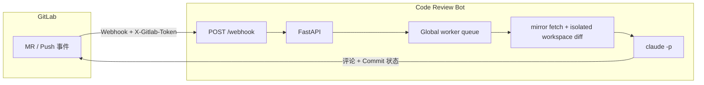

# Code Review Bot

基于 [Claude Code](https://code.claude.com/) 的 GitLab AI 代码审查服务：在 GitLab 里配置一条 Webhook（MR 或 Push），即可在每次变更时自动拉取仓库、计算 diff、调用 Claude Code 审查，并将结果同步回 MR 或 Commit。

---

## 架构与流程

GitLab 在 MR 或 Push 时向本服务发送 Webhook，服务校验 `X-Gitlab-Token` 后将审查任务放入内存队列，再由全局 worker pool 处理。不同项目可并发；同一项目不同 MR 也可并发，但最多运行 `REVIEW_PROJECT_MAX_CONCURRENCY` 个；同一 MR 多次更新时，只保留最新的待处理任务。每个任务使用独立 workspace，公共 bare mirror 只在 fetch 时按项目加锁，最后通过 GitLab API 写回评论和 Commit 状态。Claude 模型执行失败时会按配置切换备用模型重试；全局待处理队列超过 `REVIEW_QUEUE_MAX` 时会返回 `429 Queue full`。


```mermaid
flowchart LR
  subgraph GitLab
    A[MR / Push 事件]
  end
  subgraph Code Review Bot
    B[POST /webhook]
    C[FastAPI]
    D[Global worker queue]
    E[mirror fetch + isolated workspace diff]
    F[claude -p]
  end
  A -->|Webhook + X-Gitlab-Token| B
  B --> C
  C --> D
  D --> E
  E --> F
  F -->|评论 + Commit 状态| A
```

---

## 部署

支持两种方式：

- **本地运行**：需在本机安装 Claude Code CLI，并完成 Agione / Anthropic-compatible 网关配置。
- **Docker**：镜像内已包含 Claude Code，通过环境变量 `CLAUDE_CODE_SETTINGS_CONTENT` 传入 settings.json，由 entrypoint 写入 `/root/.claude/settings.json`。

### 环境变量

无论本地或 Docker，都需先配置环境变量：复制 `.env.example` 为 `.env` 后按需修改。

| 变量 | 必需 | 默认 | 说明 |
|------|:----:|------|------|
| `GITLAB_TOKEN` | ✓ | - | GitLab Personal Access Token，需具备 `api` scope，仅用于 GitLab API / clone 私有仓库 |
| `GITLAB_WEBHOOK_SECRET` | ✓ | - | GitLab Webhook 的 Secret token，用于校验 `X-Gitlab-Token` |
| `CLAUDE_CODE_SETTINGS_CONTENT` | ✓(Docker) | - | 完整 Claude Code settings.json 内容（单行 JSON） |
| `GITLAB_URL` | | `http://localhost` | GitLab 实例地址 |
| `REPO_WORKSPACE` | | `repos` | 仓库克隆缓存目录（Docker 内为 `/app/repos`） |
| `CLAUDE_CMD` | | `claude` | Claude Code 可执行命令名 |
| `CLAUDE_SKILLS_ROOT` | | `claude-skills` | Claude Code skills 目录，真实审查规则在这里维护 |
| `CLAUDE_MODEL_FALLBACKS` | | `sonnet,haiku,opus` | Claude Code 模型失败后的重试顺序，只写别名或 model id |
| `CLAUDE_RETRY_DELAY_SECONDS` | | `2` | Claude Code 切换下一个模型前的等待秒数 |
| `HOST` | | `0.0.0.0` | 服务监听地址 |
| `PORT` | | `5000` | 服务监听端口 |
| `REVIEW_TIMEOUT` | | `600` | 单次审查超时（秒） |
| `REVIEW_QUEUE_MAX` | | `100` | 全局待处理审查队列上限，超过后 `/webhook` 返回 `429 Queue full` |
| `REVIEW_WORKERS` | | `3` | 全局审查 worker 数，控制最多同时运行多少个审查任务 |
| `REVIEW_PROJECT_MAX_CONCURRENCY` | | `2` | 同一 GitLab 项目最多同时运行的审查任务数 |
| `API_TIMEOUT` | | `10` | 调用 GitLab API 超时（秒） |
| `LOG_FILE` | | 空 | 应用日志文件路径（Docker Compose 默认 `/app/logs/app.log`） |

**CLAUDE_CODE_SETTINGS_CONTENT 示例**

Docker 部署时，entrypoint 会将下列内容写入 `/root/.claude/settings.json`。`ANTHROPIC_AUTH_TOKEN` 会作为 Bearer token 发送到 Anthropic-compatible 网关；模型 ID 使用 Agione 提供的模型 ID。

```bash
CLAUDE_CODE_SETTINGS_CONTENT='{"$schema":"https://json.schemastore.org/claude-code-settings.json","model":"sonnet","availableModels":["sonnet","haiku","opus"],"env":{"ANTHROPIC_BASE_URL":"https://zh.agione.co","ANTHROPIC_AUTH_TOKEN":"<agione-api-key>","ANTHROPIC_DEFAULT_HAIKU_MODEL":"<agione-model-id>","ANTHROPIC_DEFAULT_SONNET_MODEL":"<agione-model-id>","ANTHROPIC_DEFAULT_OPUS_MODEL":"<agione-model-id>","API_TIMEOUT_MS":"3000000","CLAUDE_CODE_DISABLE_NONESSENTIAL_TRAFFIC":"1","CLAUDE_CODE_MAX_OUTPUT_TOKENS":"2000000","MAX_THINKING_TOKENS":"1024"}}'
```

`CLAUDE_MODEL_FALLBACKS=sonnet,haiku,opus` 表示服务会依次执行 `claude --model sonnet`、`claude --model haiku`、`claude --model opus`。真实 Agione 模型 ID 放在 settings JSON 的 `ANTHROPIC_DEFAULT_*_MODEL` 中；fallback 顺序里通常只写 `sonnet`、`haiku`、`opus` 这几个别名。

审查规则以 Claude Code 原生 skills 维护在 `CLAUDE_SKILLS_ROOT/.claude/skills/`，默认包含 `git-review`、`python-code-review`、`vue-code-review`、`go-code-review`、`c-code-review`。修改审查口径时优先改对应 `SKILL.md`，Python 服务只负责准备仓库和 diff。`python-code-review` 会先识别 Python 2、Python 3 或双版本兼容项目，再应用对应版本的审查规则。

仓库缓存分为两层：`REPO_WORKSPACE/mirrors/<project_id>.git` 是同项目共享的 bare mirror，只在 fetch 时加锁；`REPO_WORKSPACE/workspaces/<project_id>/<task>` 是单个审查任务的独立工作区，任务结束后自动清理。因此同一项目不同 MR 可以并发审查，不会互相切分支或覆盖工作区。

> `GITLAB_TOKEN` 与 `GITLAB_WEBHOOK_SECRET` 是两个不同凭证：前者给本服务访问 GitLab API / clone 私有仓库，后者填到 GitLab Webhook 页面里的 Secret token。

### Docker Compose 部署

环境变量配置见上一节表格，至少设置 `GITLAB_TOKEN`、`GITLAB_WEBHOOK_SECRET`、`GITLAB_URL`、`CLAUDE_CODE_SETTINGS_CONTENT`。

```bash
cd code-review-bot
cp .env.example .env
# 编辑 .env 后启动
docker compose up -d
docker compose logs -f
```

默认会挂载当前目录下的 `./repos`（仓库缓存）与 `./logs`（应用日志）。

### docker run 部署

不依赖 Compose 时，可单独构建镜像并用 `docker run` 启动：

```bash
# 在项目根目录构建镜像
docker build -t code-review-bot:latest .

# 启动容器（请将 GITLAB_URL、GITLAB_TOKEN、GITLAB_WEBHOOK_SECRET、CLAUDE_CODE_SETTINGS_CONTENT 等替换为实际值）
docker run -d \
  --name code-review-bot \
  --restart unless-stopped \
  -p 5000:5000 \
  -e GITLAB_URL=http://<你的 GitLab 地址>:端口 \
  -e GITLAB_TOKEN=<你的 Personal Access Token> \
  -e GITLAB_WEBHOOK_SECRET=<你的 GitLab Webhook Secret token> \
  -e CLAUDE_CODE_SETTINGS_CONTENT='{"$schema":"https://json.schemastore.org/claude-code-settings.json","model":"sonnet","availableModels":["sonnet","haiku","opus"],"env":{"ANTHROPIC_BASE_URL":"https://zh.agione.co","ANTHROPIC_AUTH_TOKEN":"<agione-api-key>","ANTHROPIC_DEFAULT_HAIKU_MODEL":"<agione-model-id>","ANTHROPIC_DEFAULT_SONNET_MODEL":"<agione-model-id>","ANTHROPIC_DEFAULT_OPUS_MODEL":"<agione-model-id>","API_TIMEOUT_MS":"3000000","CLAUDE_CODE_DISABLE_NONESSENTIAL_TRAFFIC":"1","CLAUDE_CODE_MAX_OUTPUT_TOKENS":"2000000","MAX_THINKING_TOKENS":"1024"}}' \
  -e CLAUDE_SKILLS_ROOT=claude-skills \
  -e CLAUDE_MODEL_FALLBACKS=sonnet,haiku,opus \
  -e CLAUDE_RETRY_DELAY_SECONDS=2 \
  -e REVIEW_WORKERS=3 \
  -e REVIEW_PROJECT_MAX_CONCURRENCY=2 \
  -e LOG_FILE=/app/logs/app.log \
  -v $(pwd)/repos:/app/repos \
  -v $(pwd)/logs:/app/logs \
  code-review-bot:latest
```

`-v` 将当前目录下的 `repos`、`logs` 挂载到容器内，便于持久化仓库缓存与日志；可按需修改路径或端口。

### 开发环境（本地）

环境变量与 [环境变量](#环境变量) 一致。此外需在本机安装 Claude Code CLI，并配置 `~/.claude/settings.json` 或直接导出 `ANTHROPIC_*` 环境变量。

**依赖**：Python 3.10+、[uv](https://docs.astral.sh/uv/)、Claude Code CLI、git

```bash
cd code-review-bot
uv sync
cp .env.example .env
# 配置 ~/.claude/settings.json 后启动
uv run uvicorn app.main:app --host 0.0.0.0 --port 5000
```

### 验证部署

服务启动后，可请求健康检查接口确认已就绪：

```bash
curl http://localhost:5000/health
# 正常返回：{"status":"ok"}
```

若使用远程主机或不同端口，将 URL 中的地址与端口替换为实际值即可。

### GitLab Webhook 配置

服务就绪后，在 GitLab 中配置 Webhook 以触发审查：

1. 进入项目 **Settings** → **Webhooks**
2. **URL**：`http://<服务地址>:5000/webhook`
3. **Secret token**：填写与服务环境变量 `GITLAB_WEBHOOK_SECRET` 相同的值
4. **Trigger**：勾选 **Merge request events**、**Push events**

保存后，在 MR 或 Push 时触发，评论区会出现 🤖 **Code Review Result**。

---

## 审查结果

| 章节 | 说明 |
|------|------|
| 审查总结 | 变更概览与整体评价（可含合入后对整体逻辑的简要判断） |
| 发现的问题 | `[严重]` 必修，`[建议]` 可选 |
| 整体影响与风险 | 合入后对整体代码逻辑的影响、与现有逻辑的冲突或潜在风险 |
| 建议 | 改进建议 |
| 结论 | **LGTM** 或 **需要修改** |

---

## 常见问题

| 现象 | 处理 |
|------|------|
| GitLab API 403 | `GITLAB_TOKEN` 需 `api` scope |
| Webhook 401 | GitLab Webhook 页面里的 Secret token 需与 `GITLAB_WEBHOOK_SECRET` 一致 |
| Webhook 400 Invalid repository URL | Webhook payload 的仓库 host 必须与 `GITLAB_URL` 一致 |
| Claude Code 认证失败 | 确认 `CLAUDE_CODE_SETTINGS_CONTENT` 完整、`ANTHROPIC_BASE_URL` / `ANTHROPIC_AUTH_TOKEN` / 模型 ID 正确 |
| Claude Code git-review skill not found | 确认 `CLAUDE_SKILLS_ROOT/.claude/skills/git-review/SKILL.md` 存在，Docker 中不要挂载覆盖该目录 |
| 主模型失败后未切换 | 确认 `CLAUDE_MODEL_FALLBACKS` 非空，且其中的别名已在 settings JSON 的 `availableModels` / `ANTHROPIC_DEFAULT_*_MODEL` 中可用 |
| 审查超时 | 调大 `REVIEW_TIMEOUT`（如 900）或 settings 中的 `API_TIMEOUT_MS` |
| Webhook 429 Queue full | 待处理任务超过 `REVIEW_QUEUE_MAX`，稍后重试或调大队列上限 |

---

## 开发文档

面向参与开发的贡献者。

### 代码结构

```
code-review-bot/
├── app/
│   ├── main.py                 # entry
│   ├── config.py               # config
│   ├── routers/webhook.py      # /webhook, /health
│   └── services/
│       ├── webhook.py          # Push/MR flow
│       ├── claude_code.py      # Git diff + Claude Code invoke
│       ├── review_queue.py     # Worker pool + project concurrency limits
│       └── gitlab.py           # GitLab API
├── scripts/
│   └── entrypoint.sh           # Docker: write Claude Code settings.json
├── claude-skills/
│   └── .claude/skills/         # Claude Code review skills
├── tests/
├── .env.example
├── Dockerfile
├── docker-compose.yml
├── pyproject.toml
└── uv.lock
```

### 代码规范

- **注释写在行上方**：不使用行内注释，注释单独占行写在对应代码上方（含 README 等文档中的代码块），与项目代码风格一致。
- **代码内注释使用英文**：便于协作与工具链兼容。
